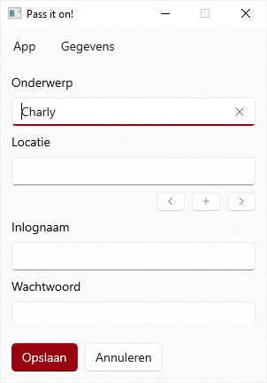

# Code name: Pass It On

Password manager, based on previous development with AutoIt.

## GUI

### Menu

| Control    | Function                                                                                      |
|:-----------|:----------------------------------------------------------------------------------------------|
| App        |
| **Info**   | open Project info page <https://github.com/Jay-o-Way/Learning-this/blob/main/PassItOn.md> |
| **Close**  | close the app                                                                                 |
| Data       |
| **Import** | import data from file                                                                         |
| **Export** | export data to file                                                                           |

### View 1: Display data

:::row:::
    :::column:::
        
    :::column-end:::
    :::column span="2":::
        | Control           | Function                                                                                       |
        |:------------------|:-----------------------------------------------------------------------------------------------|
        | ComboBox          | select existing data, or create new subject                                                    |
        | DropDown          | select different sub-items example: subject "Outlook" can contain multiple e-mail accounts |
        | **Create** button | create new subject, starting with ComboBox text                                                |
        | **Edit** button   | exit selected subject                                                                          |
        | **Delete** button | delete selected subject                                                                        |
        | HyperlinkButton   | open URL                                                                                       |
        | ComboBox          | select field "name" (often an e-mail address)                                                  |
        | TextBox           | display password                                                                               |
    :::column-end:::
:::row-end:::

### View 2: Edit data

:::row:::
    :::column:::
        
    :::column-end:::
    :::column span="2":::
        | Control           | Function            |
        |:------------------|:--------------------|
        | TextBox           | input subject title |
        | TextBox           | input location      |
        | TextBox           | input log-in name   |
        | PasswordBox       | input password      |
        | **Save** button   | confirm input       |
        | **Cancel** button | dismiss changes     |
    :::column-end:::
:::row-end:::

## To do, or not to do?

Based on the old work of the existing (AutoIt) app, we can say the following.

| Function                      | Y/M/N | Prio |
|-------------------------------|-------|------|
| Edit and Save passwords       | Y     | 1    |
| Have a Settings menu          | Y     | 2    |
| Backup/import data file       | Y     | 3    |
| Encrypted data storage        | M     | 1    |
| Main password for app         | M     | 2    |
| Translation for UI strings    | M     | 2    |
| Backup data to cloud          | N     | Ø    |
| Have update check             | N     | Ø    |

## Open questions

For open questions, have a look at [Discussions](https://github.com/Jay-o-Way/Learning-this/discussions) in this repo.

Answered questions:
<dl>
<dt>Languages</dt><dd>C#, XAML, JSON</dd>
</dl>
