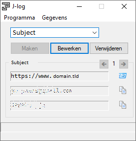

# Learning

Personal repo to learn.
That's it.

Every change I make is probably done from scratch and done with "fresh eyes". 👁 👁
It's difficult learning all the different languages, but I can say I'm proud of doing things myself.

## Software

I have made a password storage app in the past with [AutoIt](https://www.autoitscript.com). Here's a screenshot of it:

I can re-make it with modern languages. Code name: Pass It On. View [this document](PassItOn.md) for more info.
